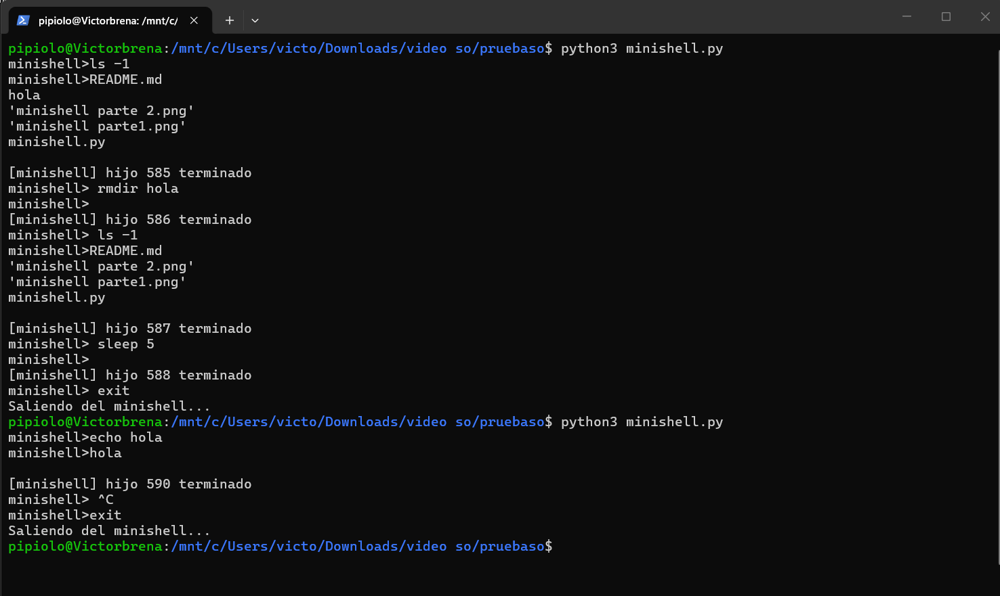

# Tarea 1

## Instrucciones de compilación/ejecución
La copmpilar/ejcutar el minishell simplemnete es necesario tener instalado python. A su vez en necsesario que el entorno sea Unix/Linux. Seguido desde la terminal:
```
python3 minishell.py
```
## Breve explicación del diseño
Su funcinamiento se basa en un bucle constante que ejecuta el programa, dentro de este el flujo es el siguiente:

1. Se muestra un prompt llamado ``minishell>``.

2. Se lee la linea de comandos ingresada por el usuairio.
3. Se separa el comando y sus argumentos usando ``shlex.split()``.
4. Se crea un proceso hijo con ``os.fork()``.
5. El proces hijo se ejecuta con el comando ``os.execvp()``.
6. El proceso padre continua ejecutandose y maneja la termiancion de hijos.

Notas:
- SIGCHLD, se uiliza para detectar cuando un proceso hijo termina.
- ``waitpid()``, se utiliza con la opcion WNOHANG para evitar bloquear el shell.
 - SIGINT (Ctrl + C), para que el shell ignore esta señal y evite terminar accidentalmente.
## Ejemplo de ejecución

Durante su ejecucion se relizaron varias pruebas, ejecutando varios comandos.



## Dificultades encontradas y cómo se resolvieron

1. Limitaciones por el entorno Windows. 

    Al ser el entorno principal Windows hubo problemas al tener que usar comandos de Unix, se resolvio utlizando una computadora virtual llamada onworks.net, donde se utilizó una maquina con entorno Ubuntu.

    Otra herramienta utilizada fue WSL con Ubuntu en powershell de Windows, esto fue mas practico y sencillo de utilizar.

2. Problemas al manejar los hijos

    La terminacion de procesos hijos, pero se resolvio utilizando SIGCHLD junto el comando WNOHANG en waitpid()

3. Prblemas con excepciones
    Hubo ciertos problemas, ya que al utilizar wsl, al ejecutar algo que no era un comando, siempre excepcion sobre permiso denegado, se intento manejar de tras manejar las excepcixones, pero mejor se dejo de la manera ma sencilla. 
