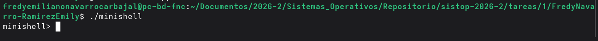
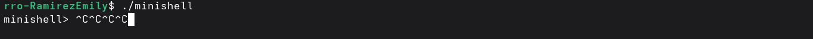
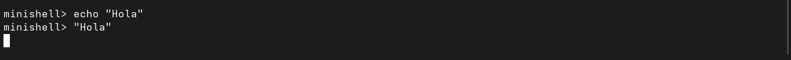

# Tarea 1: Intérprete de Comandos (Minishell) en C++

## Descripción del Proyecto
En está carpeta contiene la implementación de un minishell escrito en C++. El objetivo principal fue simular el comportamiento básico de una terminal de Linux. 

Para lograrlo, nuestro programa lee los comandos del usuario, clona el proceso actual usando `fork()`, y reemplaza la memoria del proceso hijo con el programa deseado mediante `execvp()`. Además, implementamos un manejo asíncrono de señales para proteger el intérprete y evitar dejar procesos muertos en el sistema.

## Entorno de Ejecución
* Sistema Operativo: Distribución basada en Linux/Unix.
* Compilador: GCC (`g++`) con soporte para C++ estándar.

## Instrucciones de Uso
Para compilar el código desde la terminal, utiliza el siguiente comando:
```bash
g++ minishell.cpp -o minishell -Wall
```
Una vez compilado, puedes iniciar el intérprete ejecutando:
```bash
./minishell
```
## Diseño del programa 

 - **Bucle principal y lectura de comandos** 
Para el funcionamiento del programa se usa un bucle `while(true)` que imprime el prompt `minishell>` . Con la función `getline` la usamos para capturar de forma segura toda la entrada del usuario, manejando correctamente el fin de archivo y omitiendo el procesamiento de líneas vacías.
 - **Análisis Sintáctico**
La cadena de texto capturada (`string linea_comando`) se procesa utilizando un flujo de texto (`stringstream`). De esta forma nos permite extraer cada palabra ignorando múltiples espacios en blanco, almacenando los comandos y sus parámetros de forma dinámica en un estructura de dato de tipo`vector<string>`.
 - **Comando exit** 
Antes de usar el SO, la minishell verifica si el usuario solicitó un comando propio, para nuestro caso usamos la palabra `exit`, la cual rompe el ciclo principal y permite que el proceso padre termine su ejecución de forma correcta con un `return 0`.
 - **Adaptación de argumentos** 
Para la adaptación y manejos de los argumentos nos apoyamos de `execvp()` la cual es una llamada al sistema en C que requiere un arreglo de punteros a caracteres (`char* const argv[]`), donde iteramos sobre el vector convirtiendo cada argumento con `.c_str()` y `const_cast`. Como estandar se añade obligatoriamente un puntero nulo (`nullptr`) al final de este nuevo vector (`argumentos_c`) para indicar el fin de los parámetros y evitar violaciones de segmento al leer la memoria.
 - **Procesos** 
	 - Proceso hijo
	 Restauramos el comportamiento por defecto de la señal `SIGINT` (Ctrl+C). Luego llamamos a `execvp()` pasando el comando y sus argumentos preparados. Si esta función retorna, implica que hubo una falla (comando no existe), por lo que el hijo imprime un error descriptivo en `std::cerr` y termina con `exit(1)`.
	 - Proceso padre
	 Al ser la minishell asíncrona, el padre no invoca funciones de espera de bloqueo en este punto, solamente valida que el `fork` haya sido exitoso y continúa inmediatamente a la siguiente iteración del ciclo. 

## Gestión de señales
 1. Limpieza de procesos muertos
Para este caso se uso un manejador asíncrono mediante `sigaction` . Cuando un proceso hijo termina, el manejador se activa y ejecuta un `waitpid` con la bandera `WNOHANG` dentro de un bucle `while`. Esto nos permite recolectar a los hijos terminados en segundo plano garantizando que ninguno se quede libre.
 2. Protección de interrupciones
 Si un usuario presiona `Ctrl+C`, configuramos al proceso padre para ignorar la señal (`SIG_IGN`), evitando que la minishell se cierre accidentalmente. Al restaurar el comportamiento por defecto (`SIG_DFL`) exclusivamente dentro del proceso hijo, garantizamos que comandos en ejecución (como `sleep`) puedan ser cancelados por el usuario sin afectar al padre.

## Ejemplos de ejecución 



## Dificultades 
Durante el desarrollo de este intérprete, nos enfrentamos a varios retos interesantes relacionados con la programación a nivel de sistema y la API de Unix:  
**El estándar POSIX y el manejo de argumentos:** Adaptar las estructuras de datos de C++ a las funciones clásicas de C fue uno de los primeros obstáculos ya que tuvimos que investigar como hacer esta traducción, sin causar violaciones y de esta forma respetar el estándar POSIX. 
 **Ciclo de vida de los procesos (Padre e Hijo):** Nos resulto algo tedioso entender el uso del fork, ya que tenemos dos programas ejecutándose simultáneamente en espacios de memoria distintos. Además, entender que `execvp` destruye y reemplaza por completo la imagen de memoria del proceso hijo.
 **Manejo asíncrono de señales:** En este caso aunque fue mas fácil la compresión que los procesos padre e hijos pudimos si varios procesos terminan al mismo tiempo, el sistema a veces solo envía un aviso (`SIGCHLD`). Por eso usamos un ciclo `while` con `waitpid` para asegurar que limpiamos a todos los procesos muertos de uno solo. Además, para evitar que presionar `Ctrl+C` cierre nuestro minishell por accidente, configuramos al padre para que lo ignore (`SIG_IGN`), pero se lo reactivamos al hijo (`SIG_DFL`) para poder cancelar comandos que se queden colgados sin afectar al intérprete principal. 

## Autores
 - Navarro Carbajal Fredy Emiliano 
 - Ramírez Terán Emily 

