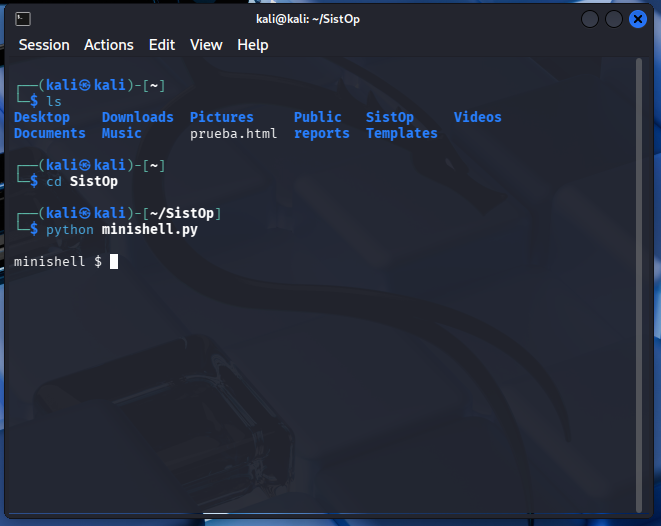
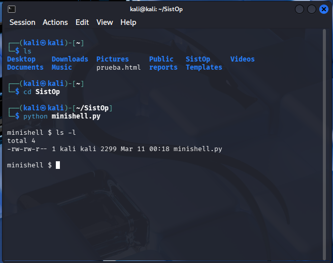
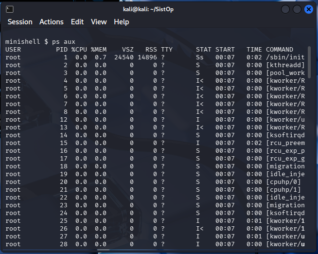
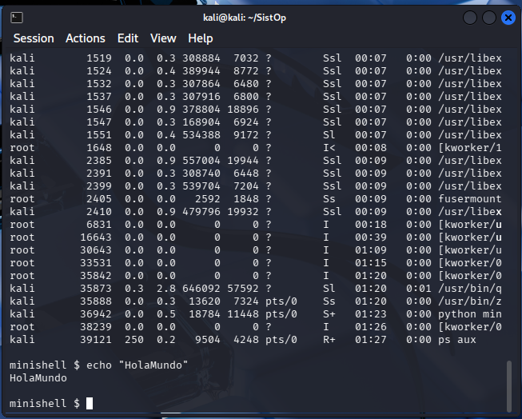
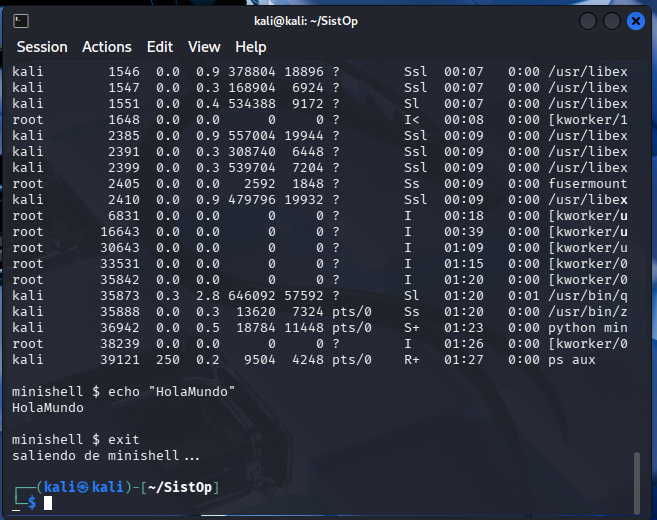
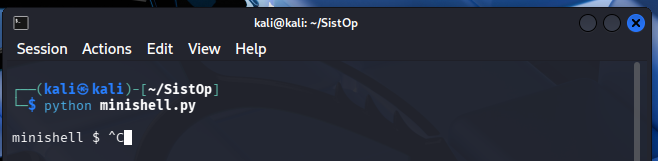

## **ALUMNOS: 
- Garibay Zamorano Josué Benjamín 
- López López Carlos Daniel 

## OBJETIVO: 
Implementar un intérprete de comandos básico (shell) que permita al usuario ejecutar programas del sistema, manejando correctamente la creación de procesos mediante fork(), la ejecución de programas con exec() y la recolección de procesos hijos con señales (SIGCHLD). 

## INSTRUCCIONES DE USO: 

Para empezar a usar la minishell de python que creamos es necesario posicionarnos primero en la carpeta donde se encuentra nuestro programa, es decir, si el programa se encuentra en escritorio “Desktop” es necesario posicionarnos primero sobre dicha carpeta para poder ejecutar nuestro programa. 

Para hacer esto podemos hacer uso de los comandos: 

$ls 

El cual nos permite ver los archivos y directorios de la dirección en donde nos encontramos posicionados. 

Y para cambiar de directorio podemos usar: 

$cd ADondeQueramosIr 

Para la sintaxis de este comando colocamos “cd” seguido del directorio al que nos queremos dirigir. 

Nota: En caso de querer corroborar que se tiene python instalado utilizamos el siguiente comando: 

$python –version 

Este nos dirá la versión de python que tenemos instalado. 

Una vez corroborado que tenemos python y posicionados en la dirección de nuestro programa, ejecutamos el siguiente comando:  

$ python [minishell.py](http://minishell.py) 

Una vez ejecutado este comando se nos mostrará a la minishell en ejecución: 

minishell $ 

Siendo aquí en donde ya podemos ejecutar todos los comando solicitados en la tarea tales como: 

$ ls -l 

$ ps aux 

$ echo “HolaMundo” 

$ exit 

Siendo ‘exit’ la única forma de salirnos de la minishell pues si intentamos con Ctrl+C no podemos detener la ejecución de la minishell. 
## DISEÑO DEL SISTEMA

Para la creación de la minishell se utilizó el lenguaje de programación Python, esto porque a diferencia de otros lenguajes como C, que son lenguajes en los que tendríamos que gestionar manualmente la memoria y punteros para manejar cadenas de texto, Python nos permite concentrar nuestro trabajo únicamente en los procesos; Además, las bibliotecas de este lenguaje para la administración de procesos y señales simplifican la implementación, reduciendo significativamente la cantidad de líneas de código necesarias sin perder acceso a las llamadas al sistema de Unix
Los puntos importantes del diseño de nuestra minishell son los siguientes:
- Creación de procesos: La minishell utiliza la función fork() para crear un proceso hijo que será el encargado de ejecutar el comando solicitado
- Ejecución: El proceso hijo reemplaza su imagen de memoria utilizando la función execvp(), permitiendo ejecutar programas del sistema con sus respectivos argumentos.

- Manejo de Señales:
	SIGINT (Ctrl+C): El proceso padre está configurado para ignorar esta señal, evitando que el programa se cierre accidentalmente. Los procesos hijos, por el contrario, mantienen el comportamiento por defecto para poder ser interrumpidos por el usuario.
	SIGCHLD: Se implementó un manejador de señales asíncrono que utiliza waitpid() con la opción WNOHANG. Esto permite recolectar los procesos hijos que finalizan sin bloquear la ejecución de la shell, evitando la creación de procesos "zombie".
      
## EJEMPLOS DE EJECUCIÓN 
Para la visualización de este ejemplo utilizaremos la máquina virtual (VM) de Kali Linux. 
En esta primera imagen podemos observar la manera de ejecutar la minishell, como ya se había mencionado anteriormente es necesario para esto el posicionarnos en la carpeta donde se encuentra nuestro programa, en este caso nuestro programa se encontraba en la carpeta “SistOp”. 

**Una vez en nuestra minishell, ejecutamos el comando: 

minishell $ ls -l 

El cual nos muestra el contenido de un directorio en formato largo.** 

**

Después ejecutamos el siguiente comando: 

minishell $ ps aux 

El cual nos muestra todos los procesos en ejecución.

** 

**Posteriormente ejecutamos: 

minishell $ echo “HolaMundo” 

El cual nos imprime el mensaje HolaMundo en nuestra terminal.** 

**

Finalmente ejecutamos: 

minishell $ exit 

El cual nos ayuda a terminar con la ejecución de la minishell.

** 

**En esta parte también mostramos como al ejecutar un Ctrl+C no se termina con la ejecución de la minishell:** 

**

## DIFICULTADES ENCONTRADAS 

- Se presentó la dificultad de comprender la implementación exacta de las llamadas al sistema para procesos y señales. Esto se solucionó mediante el estudio de la documentación técnica de las bibliotecas os y signal, lo que permitió identificar el uso correcto de funciones críticas como fork(), execvp() y el manejo de waitpid() con la opción WNOHANG.
- El sistema genera procesos finalizados que no se borran de memoria hasta que el padre los reconoce, lo cual se soluciono usando waitpid() con WNOHANG de forma asíncrona.
** 